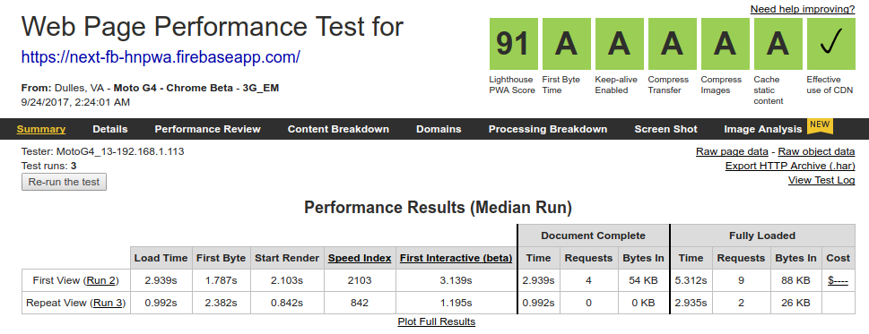
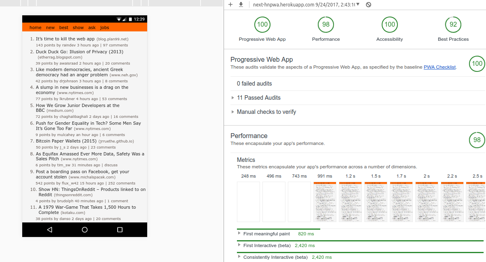
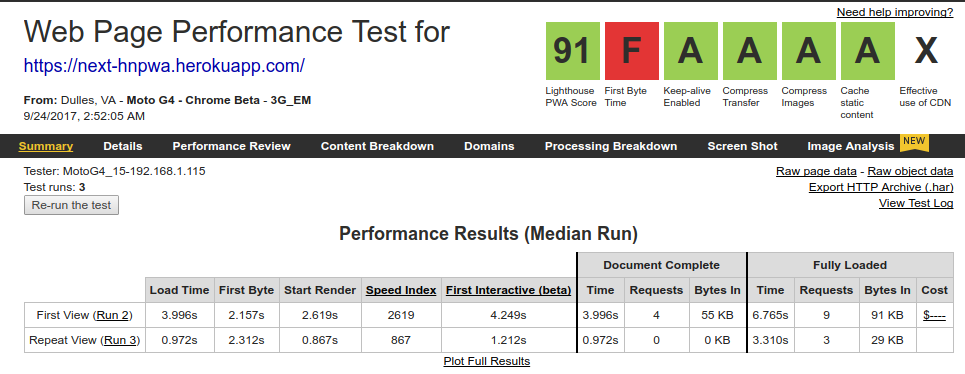
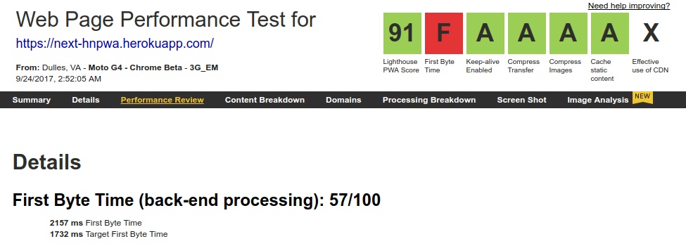

# A PWA made using Next.js and the Hacker News API 

- Single page app
- Works just as well with JavaScript disabled
- Code split and bundled to minimize the payload on the first visit (automatically done by Next.js)

## Served Using Firebase Functions and Static Hosting

https://next-fb-hnpwa.firebaseapp.com/

### Local Lighthouse Results:

### WebPageTest.org Results:

Complete results (emerging markets): https://www.webpagetest.org/result/170924_BQ_08b80e1854f5bfa0c5b36d10a5373b1e/
Complete results (faster 3G): https://www.webpagetest.org/result/170924_SG_e20c408039688ecdcc07205ff6a91299/

## Hosted on Heroku

https://next-hnpwa.herokuapp.com

### Local Lighthouse Results:

### WebPageTest.org Results:

The timings that resulted in an `F` for the 'First Byte Time' are as shown below:

Complete results: https://www.webpagetest.org/result/170923_TJ_70e85a49a2ab814ff7134a8019384b20/
